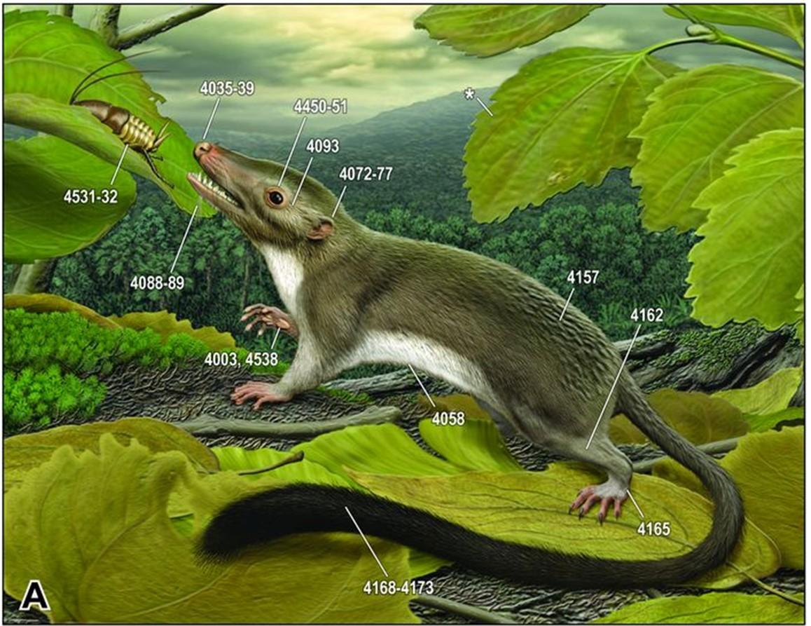
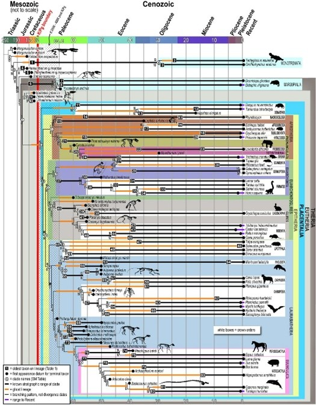

# Computational Practice: Hypothesizing function in conserved non-coding (CNC) genomic sequences

##  Lab Overview
We don’t know everything about the human genome.  If we did, there would be no disease and all bioinformatics professors would be genetically engineered to be more interesting!    For example, find chr3:137,329,393-137,330,121 (hg38 build) in the human genome.  Press the “Hide All” button to turn off all tracks.  Turn “Conservation” tracks on to “Full view”.  Note how this DNA segment is highly conserved among mammals.  Take a look at the armadillo genome conservation with human.  Here is the taxonomy lineage for each genome taken from the NCBI Taxonomy Browser for these two species:

Armadillo
========
cellular organisms; Eukaryota; Opisthokonta; Metazoa; Eumetazoa; Bilateria; Deuterostomia; Chordata; Craniata; Vertebrata; Gnathostomata; Teleostomi; Euteleostomi; Sarcopterygii; Dipnotetrapodomorpha; Tetrapoda; Amniota; Mammalia; Theria; Eutheria; Xenarthra; Cingulata; Dasypodidae; Dasypus; Dasypus novemcinctus

Human
========
cellular organisms; Eukaryota; Opisthokonta; Metazoa; Eumetazoa; Bilateria; Deuterostomia; Chordata; Craniata; Vertebrata; Gnathostomata; Teleostomi; Euteleostomi; Sarcopterygii; Dipnotetrapodomorpha; Tetrapoda; Amniota; Mammalia; Theria; Eutheria; Boreoeutheria; Euarchontoglires; Primates; Haplorrhini; Simiiformes; Catarrhini; Hominoidea; Hominidae; Homininae; Homo sapiens

So, there was a common ancestor to us and armadillos that could be classified as a Eutherian with a genome that contained a similar DNA sequence now found in the Xenarthra and Boreoeutheria lineages (left).  From what I can tell, it looks like this ancestor lived ~60 million years ago before evolving into armadillos and humans.  In fact, based on fossil evidence, your and an armadillo’s great-great-great-great-great-great+(X-great) grandmaw might have looked like below.  (MA O'Leary et al.  The Placental Mammal Ancestor and the Post–K-Pg Radiation of Placentals. 2013 Vol. 339 no. 6120 pp. 662-667).  

[]
[]
##  Lab Objectives:
In this lab you will find a conserved piece of DNA in the human reference genome and hypothesize on its function.

* Find a piece of conserved DNA
* Search genome browser tracks that could explain the function of this conserved piece of DNA

Follow these lab instructions:

###  Task A: 
What molecular function could be encoded in this piece of conserved DNA?  
Clearly state a brief hypothesis as to what this chromosomal segment could be doing and provide evidence from any UCSC tracks (be concise) that support your hypothesis. You can pinpoint this piece of DNA in the hg38 genome build using the coordinates and unlock annotations (i.e. tracks) from that genome build. Do you think this piece of DNA is encoding the same function in Armadillos and Humans?   Is it a gene or something else?
